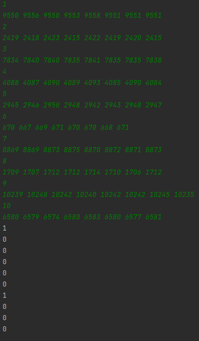
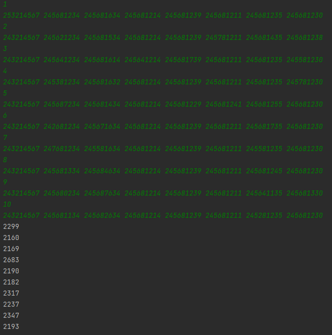
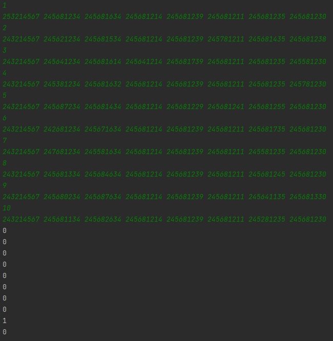

# [암호생성기](https://swexpertacademy.com/main/code/problem/problemDetail.do?contestProbId=AV14uWl6AF0CFAYD)

> 링크: <https://swexpertacademy.com/main/code/problem/problemDetail.do?contestProbId=AV14uWl6AF0CFAYD>  
> 레벨: `D3`  
> 태그: `배열, 덱`  
> 날짜: 2024-08-16

### 제약사항

- 테스트케이스 : 10
- 배열크기 : 8
- MAX 값 : Integer
- 메모리 256mb
- 시간 : 20초

### 풀이

문제에서 1사이클은 배열의 시프트 + 스왑으로 정의된다.

1사이클당 시프트 + 스왑연산 5번이 발생한다. 시뮬레이션으로 접근해서 바로 해결가능할 수도 있으나,



1사이클에 감소하는 숫자는 1~5로, 문제에서 주어진 수의 최대크기인 Integer의 max는 21억이니

최악의경우 최대 11억번 스왑 연산을 해야한다.




사이클당 영향을 받는 수는 5개, 배열크기는 8개로 `고정`이다.  
최소공배수인 40에 맞게 8사이클을 진행한다면 배열의 모든요소가 사이클의 영향을 똑같이 받게 된다.

이를 이용하여 사이클 수를 최소화하여 상수시간내에 문제를 해결할 수 있다.




- 시간복잡도: O(1), (O(n),배열의크기)


### 코드

```java
public class Solution {
    public static void main(String[] args) throws IOException {
        BufferedReader br = new BufferedReader(new InputStreamReader(System.in));
        StringBuilder sb = new StringBuilder();
        for(int tc=1;tc<=10;tc++) {
            br.readLine();
            String[] strs = br.readLine().split(" ");

            // 숫자배열의 크기는 8 고정
            int[] arr = new int[8];

            // 8개의 숫자를 15로 나눴을때의 몫의 최소값을 구한다.
            int minDivider = Integer.MAX_VALUE;
            for(int i=0;i<8;i++) {
                arr[i] = Integer.parseInt(strs[i]);
                int divider = arr[i]/15;
                if(divider < minDivider) {
                    minDivider = divider;
                }
            }

            // 한번에 15씩 나눴기 때문에, 0인채로 끌려다닌 녀셕이 있을 수도 있다..
            for(int i=0;i<8;i++) {
                arr[i] -= minDivider*15;
                arr[i] += 15;
            }

            ArrayDeque<Integer> deque = new ArrayDeque<>();
            for(int i:arr){
                deque.add(i);
            }

            // 문제에서 정의한 사이클을 반복한다.
            while(doCycle(deque)){}

            sb.append("#"+tc);
            for(int i:deque){
                sb.append(" "+i);
            }
            sb.append("\n");
        }
        System.out.println(sb);
    }

    public static boolean doCycle(ArrayDeque<Integer> deque){
        for(int i=1;i<=5;i++){
            Integer val = deque.poll();
            val-=i;
            if(val<=0){
                val = 0;
                deque.addLast(val);
                return false;
            }
            deque.addLast(val);
        }
        return true;
    }
}
```
