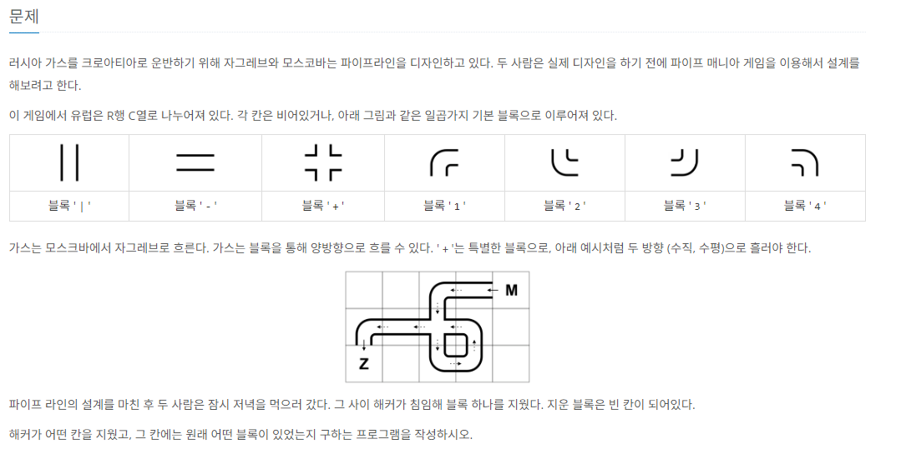

# [가스관](https://www.acmicpc.net/problem/2931)

> 링크: <https://www.acmicpc.net/problem/2931>  
> 레벨: `G2`  
> 태그: `구현, 시뮬레이션`  
> 날짜: 2024-08-27

### 제약사항

- 테스트케이스 : 1
- 배열크기 : 25^2
- MAX 값 : 해당 없음
- 메모리 128mb
- 시간 : 1초



### 문제요약

A지점에서 B지점으로 가스를 운반하기 위해 파이프라인을 설계중이다..  
완성된 파이프라인의 블록 1개를 삭제했을때, 삭제된 블록의 위치와 원래 어떤 블록이었는지를 찾는 프로그램을 작성하라.

### 생각

- 삭제된 블록의 위치를 어떻게 식별할 수 있을까?

  - 파이프라인은 완성되어 있었다.
  - 완성된 파이프라인에서 한개의 블럭만 삭제되었기 떄문에
  - 출발지 , 목적지에서 연결된 파이프를 따라 나아가다보면 삭제된 파이프가 있던 위치에 도달하게 된다.

- 이 파이프의 모양을 어떻게 판단할까?

  - 4방위 탐색을 진행하여 파이프가 존재하는지 유무를 체크하여,
  - 파이프의 모양이 연결되어 있는지 확인
  - 확인된 모양에 맞는 파이프를 사용한다.

- 왜 파이프의 모양을 확인해야하는가?

  - 파이프를 빙 둘러서 목적지에 도달하는 경우가 있기 떄문.

### 풀이

배열의 크기가 크지 않다. 25^2 = 625

1. 파이프를 찾는다.
2. 파이프에 연결된 방향으로 나아갔을때, 빈 공간을 만나게 된다면 이 위치가 삭제된 블럭이 있던 위치일 것이다. ( 좌표 )
3. 모든 파이프에 대해 적용한다면, 삭제된 블럭이 어떤 모양인지 식별할 수 있다. (모양)

### 코드

```java

import java.io.BufferedReader;
import java.io.IOException;
import java.io.InputStreamReader;
import java.util.ArrayList;
import java.util.Arrays;
import java.util.HashMap;
import java.util.Set;

public class Main {

    public static void main(String[] args) throws IOException {

        BufferedReader br = new BufferedReader(new InputStreamReader(System.in));
        StringBuilder sb = new StringBuilder();
        String[] strs = br.readLine().split(" ");

        int ySize = Integer.parseInt(strs[0]);
        int xSize = Integer.parseInt(strs[1]);

        char[][] map = new char[ySize][xSize];
        for(int i=0;i<ySize;i++) {
            String str = br.readLine();
            for(int j=0;j<xSize;j++) {
                map[i][j] = str.charAt(j);
            }
        }

        // 입력 모두 받았다..

        HashMap<Character, int[][]> hmap = new HashMap<>();
        hmap.put('|', new int[][]{{-1,0},{1,0}});
        hmap.put('-', new int[][]{{0,1},{0,-1}});
        hmap.put('+', new int[][]{{-1,0},{1,0},{0,1},{0,-1}});
        hmap.put('1', new int[][]{{1,0},{0,1}});
        hmap.put('2', new int[][]{{-1,0},{0,1}});
        hmap.put('3', new int[][]{{-1,0},{0,-1}});
        hmap.put('4', new int[][]{{1,0},{0,-1}});

        boolean[][] visits = new boolean[ySize][xSize];

        ArrayList<int[]> answerList = getAns(visits,map,hmap);

        Set<Character> keySet = hmap.keySet();

        key : for(Character key : keySet) {
            int[][] arr = hmap.get(key);
            if(arr.length!=answerList.size()) {
                continue;
            }
            for(int i=0;i<arr.length;i++) {

                boolean matched = false;

                for(int[] direction : answerList) {
                    if(Arrays.equals(direction, arr[i])) {
                        matched = true;
                    }
                }
                if(!matched) {
                    continue key;
                }
            }
            sb.append(answerY+1).append(" ").append(answerX+1).append(" ").append(key);
            System.out.println(sb);
            return;
        }

    }
    static int answerY = 0;
    static int answerX = 0;

    public static ArrayList<int[]> getAns(boolean[][] visits,char[][] map, HashMap<Character, int[][]> hmap) {

        ArrayList<int[]> alist = new ArrayList<>();

        for(int i=0;i<visits.length;i++) {
            for(int j=0;j<visits[0].length;j++) {

                if(map[i][j]=='.'
                        ||map[i][j]=='M'
                        ||map[i][j]=='Z') {
                    continue;
                }
                if(visits[i][j]) {
                    continue;
                }
                visits[i][j] = true;
                int[][] nDirections = hmap.get(map[i][j]);
                for(int[] direction: nDirections) {
                    int ny = i+direction[0];
                    int nx = j+direction[1];
                    if(ny<0 || nx<0 || ny>=map.length || nx >=map[0].length) {
                        continue;
                    }

                    if(map[ny][nx]=='.') {
                        answerY = ny;
                        answerX = nx;
                        int[] answerDelta = {-direction[0],-direction[1]};
                        alist.add(answerDelta);
                    }
                }

            }
        }
        return alist;
    }
}


```

### 어려웠던 점

- 출발지 / 목적지에서 연결된 파이프만 조사하면 안된다는점
- 연결 방향에서 모양에 해당하는 Charactor를 뽑기
