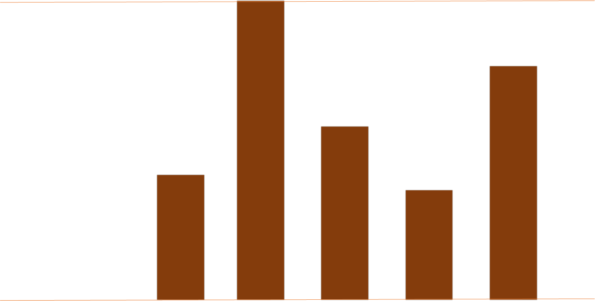
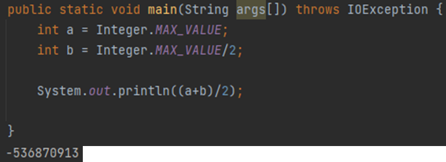

# [나무자르기](https://www.acmicpc.net/problem/2805)

> 링크: <https://www.acmicpc.net/problem/2805>  
> 레벨: `S2`  
> 태그: `이분탐색, 매개변수탐색`  
> 날짜: 2024-08-21

### 제약사항

- 테스트케이스 : 1
- 배열크기 : 1,000,000
- MAX 값 : 2,000,000,000 (거의 MAX_INTEGER)
- 메모리 256mb
- 시간 : 1초

### 풀이

나무들이 여럿 있다.




</br>
</br>

나무를 자른 지점 윗부분을 가져갈 수 있을 때,어디를 기준으로 자르면 필요한 나무 이상을 챙겨가면서 나무의 손상을 최소화 할 수 있는가????

높이를 1씩 조정하는것은 나무의 길이가 최대 20억임을 고려했을때, 너무나도 오래걸린다.

UP DOWN 게임처럼 어느지점 위, 어느지점 아래 방식을 프로그램적으로 효율적인 이분탐색을 활용하여 문제를 해결.


- 시간복잡도: O(nlogn)  
  나무의 합을 구할 때, 배열을 순회하므로 n 만큼,  
  이분탐색을 적용하여 나무를 자를 지점을 찾는 logn 만큼의 시간복잡도가 예상된다.

</br>
</br>

### 주의사항

배열의 크기가 최대 100만이고, 시간은 1초가 주어졌다.

따라서 문제에서 요구하는 시간복잡도는 O(nlogn) 이하이다.

O(nlogn)의 시간복잡도를 가진다면, 연산량은 최소 2천만정도로 예상되어 연산에 따라 시간이 부족할 수 있다.

또한 다루는 자료의 수가 20억정도로, int형을 사용할 시 오버플로우가 발생할 수 있음에 유의해야한다.




이를 방지하기위해

1. long과 같은 범위가 큰 자료형을 사용
2. 오버플로우가 발생하는것을 검출하여 처리

와 같은 방법을 사용할 수 있다.


### 코드

```java
import java.io.BufferedReader;
import java.io.IOException;
import java.io.InputStreamReader;
import java.util.HashSet;

public class Main {

	public static void main(String[] args) throws IOException {

		BufferedReader br = new BufferedReader(new InputStreamReader(System.in));


		String[] strs = br.readLine().split(" ");

		int N = Integer.parseInt(strs[0]);
		int M = Integer.parseInt(strs[1]);

		strs = br.readLine().split(" ");
		int[] arr = new int[N];

		int maxWoodLength = 0;
		for(int i=0;i<N;i++) {
			arr[i] = Integer.parseInt(strs[i]);
			if(maxWoodLength<arr[i]) {
				maxWoodLength = arr[i];
			}
		}

		// 입력종료


		int height = 0;
		int dHeight = maxWoodLength;

		int answer = 0;

		HashSet<Integer> visits = new HashSet<>();
		checkCycle : while(true) {
			if(dHeight!=1) {
				dHeight>>=1;
			}else {
				if(visits.contains(height)) {
					break;
				}
			}
//			System.out.println(height);
			visits.add(height);
			int sum = 0;
			for(int i=0;i<N;i++) {
				if(arr[i]<height) {
					continue;
				}

				sum+=arr[i]-height;
				if(sum<0) { // 오버플로우 발생.. 톱의 높이를 높여라.
					height += dHeight;
					continue checkCycle;
				}
			}
			if(sum<M) { // 높의 높이를 낮춰라.
				height -= dHeight;
			}else if(sum>=M){ // 톱의 높이를 높여라.
				answer = Math.max(height, answer);
				height += dHeight;
			}
		}

		System.out.println(answer);


	}
}
```

### 수정코드

```java

import java.io.BufferedReader;
import java.io.IOException;
import java.io.InputStreamReader;
import java.util.HashSet;

public class Main {

    public static void main(String[] args) throws IOException {

        BufferedReader br = new BufferedReader(new InputStreamReader(System.in));

        String[] strs = br.readLine().split(" ");

        int N = Integer.parseInt(strs[0]);
        int M = Integer.parseInt(strs[1]);

        strs = br.readLine().split(" ");
        int[] arr = new int[N];

        int maxWoodLength = 0;
        for(int i=0;i<N;i++) {
            arr[i] = Integer.parseInt(strs[i]);
            if(maxWoodLength<arr[i]) {
                maxWoodLength = arr[i];
            }
        }

        int min = 0;
        int max = maxWoodLength;
        int answer = 0;

        checkCycle : while(min<=max) {
            int height = (max+min)/2;
            int sum = 0;
            for(int i=0;i<N;i++) {
                if(arr[i]<height) {
                    continue;
                }
                sum+=arr[i]-height;
                if(sum<0) { // 오버플로우 발생.. 톱의 높이를 높여라.
                    min = height;
                    continue checkCycle;
                }
            }
            if(sum<M) { // 높의 높이를 낮춰라.
                max = height-1;
            }else if(sum>=M){ // 톱의 높이를 높여라.
                answer = Math.max(height, answer);
                min = height+1;
            }
        }

        System.out.println(answer);

    }
}

```
